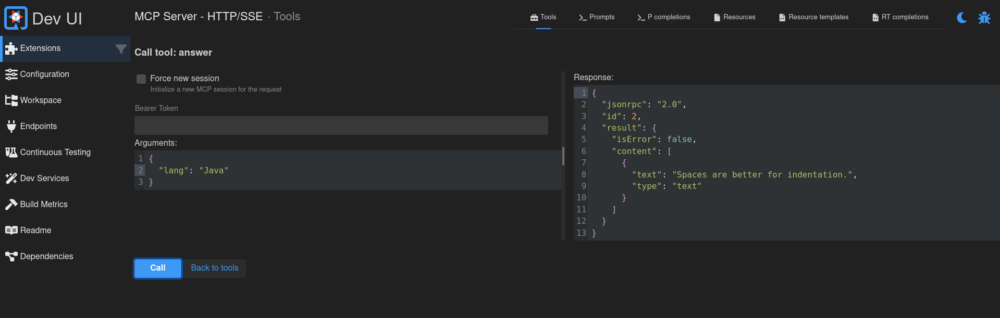

## Building efficient MCP servers efficiently

### with Quarkus

#### Martin Kouba

Riviera DEV 2025

---

### Who is Martin?

- Introvert
- Fan of open source
- Software engineer at Ret Hat/IBM
- Quarkus MCP server contributor/maintainer

---

### What's the plan for today?

- [~] Oh no, MCP again?
- [~] Quarkus MCP server: history, goals & design
- [~] What does the API look like?
- [~] Advanced features
- [~] Quarkus MCP.NEXT?

---

### Slides and examples


<span class="demo" style="font-size:1.1em;">👀</span> ➵ https://github.com/mkouba/rivieradev2025

---


### Part 1 - MCP

---

### MCP - Model Context Protocol

- [~] Open protocol (MIT License) for integration between LLM applications and external resources and tools
- [~] [Specification](https://modelcontextprotocol.io/specification/2025-03-26): `2024-11-05`, `2025-03-26` and `2025-06-18`
- [~] Official SDKs (Python, TypeScript, Rust, ...) 
- [~] MCP Inspector - testing tool for MCP servers

---

### MCP missing pieces

- [~] Not backed by a foundation
- [~] No clear development/review process
- [~] No shared API
- [~] No TCK (Technology Compatibility Kit)

---

### MCP concepts

- [~] MCP client ⇆ MCP server
- [~] JSON-RPC 2.0 messages
- [~] Transport - how messages are sent and received
- [~] Server features: tools, prompts, resources
- [~] Client features: sampling, roots, (elicitation)

---

### MCP transports

- [~] MCP currently defines two standard transports for communication
- [~] `stdio` transport starts an MCP server as a subprocess and communicates over standard in/out
- [~] `http` transport; clients connect to a running HTTP server

---

### HTTP transport variants

- [~] "HTTP/SSE" transport introduced in `2024-11-05` (considered deprecated but still supported by most clients and servers)
- [~] "Streamable HTTP" introduced in `2025-03-26`
- [~] Is "Streamable HTTP" better than the legacy "HTTP/SSE"? I'm not so sure but...

---

### MCP summary

[~] ➵➵➵➵➵ Wild West

---

### Part 2 - History, goals & design

---

### What's quarkus-mcp-server?

- [~] Quarkus extension that lives in Quarkiverse
- [~] [1.0.0.Alpha1](https://github.com/quarkiverse/quarkus-mcp-server/releases/tag/1.0.0.Alpha1) released in December 2024
- [~] [1.0.0](https://github.com/quarkiverse/quarkus-mcp-server/releases/tag/1.0.0) released in April 2025
- [~] The latest version is 1.3.0, released two weeks ago

---

### Goals

1. [~] Unified declarative and programmatic API to implement MCP server features (tools, prompts and resources) independent of the selected transport
2. [~] Quarkus-idiomatic

---

### Design

- [~] Leverage the CDI programming model
- [~] Declarative API: annotate business methods of CDI beans
- [~] Programmatic API: `@Inject` a manager bean and use a fluent API to register a feature

---

### Supported transports

- [~] The `stdio` transport ✅
- [~] Both variants of the `http` transport ✅
  - [~] "Resumability and Redelivery" for the Streamable HTTP not supported yet ❌
  - [~] "Subsidiary SSE stream" for the Streamable HTTP not supported yet ❌

---


### Part 3 - Quarkus MCP server API

---

### Declarative API in action <span class="demo">👀</span>

```java[1: 1-15|6-8|9-11|12-15]
import io.quarkiverse.mcp.server.Tool;
import io.quarkiverse.mcp.server.ToolArg;

public class Tools {

   @Tool(description = """
         Answer the ultimate question to tabs vs. spaces
         """)
   String answer(
           @ToolArg(description = "The programming language")
           String lang) {
      if ("python".equalsIgnoreCase(lang)) {
        return "Tabs are better for indentation.";
      }
      return "Spaces are better for indentation.";
   }
}
```

---

### Let's try this!

Demo time! Let's use goose!

---

### Execution model

- [~] Feature methods may be blocking or non-blocking logic
- [~] Execution model is determined by the method signature and additional annotations such as `@Blocking`, `@NonBlocking`, `@RunOnVirtualThread` or `@Transactional`

---

### Reactive tool in action

```java[1: 1-16|7-9|10-12|13-16]
import io.quarkiverse.mcp.server.Tool;
import io.quarkiverse.mcp.server.ToolArg;
import io.smallrye.mutiny.Uni;

public class Tools {

   @Tool(description = """
         Answer the ultimate question to tabs vs. spaces
         """)
   Uni<String> answer(
                @ToolArg(description = "The programming language")
                String lang) {
      if ("python".equalsIgnoreCase(lang)) {
        return Uni.createFrom().item("Tabs are better for indentation.");
      }
      return Uni.createFrom().item("Spaces are better for indentation.");
   }
}
```

---

### Programmatic API in action

```java[1: 1-15|3-4|6-18]
public class Tools {

    @Inject
    ToolManager toolManager; 

    @Startup 
    void addTools() {
       toolManager.newTool("theAnswer") 
          .setDescription("Answer the ultimate question to tabs vs. spaces")
          .addArgument("lang", "The programming language", true, String.class)
          .setHandler(
             toolArgs -> {
                if ("python".equalsIgnoreCase(toolArgs.args().get("lang").toString())) {
                   return ToolResponse.success("Tabs are better for indentation.");
                }
                return ToolResponse.success("Spaces are better for indentation.");
             })
          .register(); 
    }
}
```

---

### Part 4 - Advanced features
(a small part)

---


### Traffic logging <span class="demo">👀</span>

- Transport-agnostic
- Log all JSON messages sent/received

```properties
quarkus.mcp.server.traffic-logging.enabled=true
quarkus.mcp.server.traffic-logging.text-limit=1500
```

---

### Dev UI <span class="demo">👀</span>



---

### Client logging <span class="demo">👀</span>

```java[1: 1-15|8-10]
public class Tools {

    @Tool(description = """
            Answer the ultimate question to tabs vs. spaces
            """)
    String theAnswer(
            @ToolArg(description = "The programming language", defaultValue = "Java") String lang,
            McpLog log) {
        log.info("Let's try to answer the question for lang: %s",
           lang);
        if ("python".equalsIgnoreCase(lang)) {
            return "Tabs are better for indentation.";
        }
        return "Spaces are better for indentation.";
    }
}
```

---

### Tools - optional arguments and default values

```java[1: 1-23|11-12|18|13-14|15-17]
import java.util.Optional;
import io.quarkiverse.mcp.server.Tool;
import io.quarkiverse.mcp.server.ToolArg;

public class Tools {

   @Tool(description = """
         Answer the ultimate question to tabs vs. spaces
         """)
   String answer(
           @ToolArg(description = "The programming language")
           Optional<String> lang,
           @ToolArg(description = "The age of the programmer", defaultValue = "44")
           int age) {
      if (age < 30 ) {
         throw new ToolCallException("The programmer is too young to care...");
      }
      if (lang.isPresent() && "python".equalsIgnoreCase(lang.get())) {
        return "Tabs are better for indentation.";
      }
      return "Spaces are better for indentation.";
   }
}
```

---

### Initial checks

```java[1: 1-12|5|7-11]
import io.quarkiverse.mcp.server.InitialCheck;
import io.quarkiverse.mcp.server.InitialCheck.CheckResult;
import io.quarkiverse.mcp.server.InitialRequest;

public class SamplingCheck implements InitialCheck {

   public Uni<CheckResult> perform(InitialRequest initialRequest) {
      return initialRequest.supportsSampling()
               ? CheckResult.successs()
               : CheckResult.error("Sampling not supported");
   }
}
```

---

### Progress API <span class="demo">👀</span>

```java[1: 1-34|8-12|13-17|28|30-31]
import io.quarkiverse.mcp.server.Progress;

public class LongRunningTools {

    @Inject
    ExecutorService executor;

    @Tool
    Uni<String> longRunning(Progress progress) {
        if (progress.token().isEmpty()) {
            return Uni.createFrom().item("Client does not support progress notifications!");
        }
        ProgressTracker tracker = progress.trackerBuilder()
                .setDefaultStep(1)
                .setTotal(10)
                .setMessageBuilder(i -> "Long running progress: " + i)
                .build();

        CompletableFuture<String> ret = new CompletableFuture<String>();
        executor.execute(() -> {
            for (int i = 0; i < 10; i++) {
                try {
                    // Do something that takes time...
                    TimeUnit.MILLISECONDS.sleep(500);
                } catch (InterruptedException e) {
                    Thread.currentThread().interrupt();
                }
                tracker.advanceAndForget();
            }
            // Finish the tool call
            ret.complete("ok");
        });
        return Uni.createFrom().completionStage(ret);
    }
}
```

---

### Sampling <span class="demo">👀</span>

```java[1: 1-17|6|7-16|18]
import io.quarkiverse.mcp.server.Sampling;

public class Tools {

    @Tool(description = "Just test the sampling feature")
    Uni<String> justTestSampling(Sampling sampling, String topic) {
        if (sampling.isSupported()) {
            SamplingRequest samplingRequest = sampling.requestBuilder()
                    .setMaxTokens(100)
                    .addMessage(
                       SamplingMessage.withUserRole(
                          "Tell me more about " + topic))
                    .build();
            return samplingRequest
               .send()
               .map(response -> response.content().asText().text());
        } else {
           throw new ToolCallException("Sampling not supported");
        }
    }
}
```

---

### Testing! <span class="demo">👀</span>

```java[1: 1-22|9-13|15-19|15-24]
@QuarkusTest
public class ToolsAnswerTest {

    @TestHTTPResource
    URI testUri;

    @Test
    public void testAnswer() {
        McpStremableTestClient client = McpAssured
                .newStreamableClient()
                .setBaseUri(testUri)
                .build()
                .connect();

        client.when()
                .toolsCall("theAnswer", Map.of("lang", "Java"), r -> {
                    assertEquals("Spaces are better for indentation.", 
                       r.content().get(0).asText().text());
                })
                .toolsCall("theAnswer", Map.of("lang", "python"), r -> {
                    assertEquals("Tabs are better for indentation.", 
                       r.content().get(0).asText().text());
                })
                .thenAssertResults();
    }

}
```

---

### Part 5 - Quarkus MCP.Next

- [~] ~~Improve the testing story~~
- [~] WebSocket transport
- [~] Security

---

### And that's all!


https://github.com/mkouba/rivieradev2025

Thank you!
