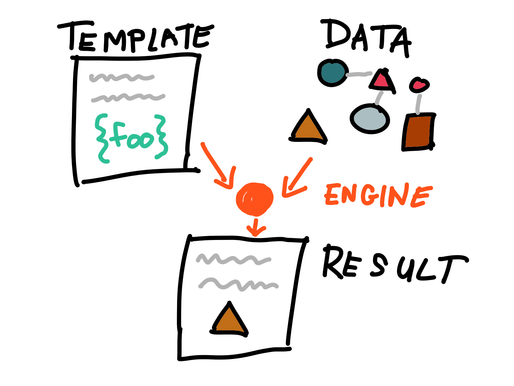

## A Qute story

### Rethinking templating in Quarkus

#### Martin Kouba

Riviera DEV 2025

---

### Who is Martin?

- [~] Introvert
- [~] Fan of open source, not only in software
- [~] Software engineer at Ret Hat/IBM
- [~] Quarkus core contributor

---

### What's the plan for today?

- [~] Qute history, goals & design
- [~] What happens under the hood?
- [~] Extensibility use case - template extension methods
- [~] Integration use cases
- [~] Qute.next?

---

### Part 1 - Qute history, goals & design

---

### What is Qute?

- **QU**arkus **TE**mplating
- Quarkus extension
- Introduced in Quarkus [1.1.0.CR1](https://github.com/quarkusio/quarkus/pull/5793), ~ 6 years ago

---



---

### Templates you say...

- [~] ✅ The good thing: everybody understands templates
- [~] ❌ The bad thing: everybody UNDERSTANDS templates

---

### What's the adoption of Qute?

- [~] We don't know the numbers!
- [~] But we fixed a number of bugs!
- [~] ???

---

### Original design goals for Qute

- [~] Simple syntax with minimal logic
- [~] Extensibility
- [~] Optional build-time validations
- [~] Friendly to [Quarkus Reactive Architecture](https://quarkus.io/guides/quarkus-reactive-architecture)
- [~] Friendly to native images
- [~] Decent performance
- [~] First-class Quarkus citizen

---

### Have we achieved all those goals?

[~] Yes ✅ and no ❌.

---

### What went wrong? #1

- Simple syntax with minimal logic
- [~] <span class="red">*Too many users requested more powerful syntax with complex logic*</span>

---

### What went wrong? #2

- Extensibility
- [~] <span class="red">*TODO*</span>

---

### What went wrong? #3

- Optional build-time validations
- [~] <span class="red">*TODO*</span>

---

### What went wrong? #4

- Friendly to [Quarkus Reactive Architecture](https://quarkus.io/guides/quarkus-reactive-architecture) VS Decent performance
- [~] <span class="red">*TODO*</span>

---

### What went wrong? #5

- Friendly to native images
- [~] <span class="red">*TODO*</span>

---

### Part 2 - What happens under the hood?

---


### What happens under the hood?

1. Build time - analyse, validate, generate
2. Runtime - initialize, parse, watch

---


### Template hello.html

```html[1: 1-15|6|8-10|13]
<html>
<head>
   <title>Hello Riviera DEV 2025</title>
</head>
<body>
   <p>Hello {name ?: "Jean"}!</p>
   <ul>
   {#for header in headers.sorted.reversed}
      <li>{header}</li>
   {/for}
   </ul>
   <hr>
   Uptime: {cdi:upTime.seconds} s
</body>
</html>
```

---

### JAX-RS resource

```java[1: 1-15|4-5|9-13]
@Path("/hello")
public class HelloResource {

    record hello(String name, List<String> headers) 
             implements TemplateInstance {}

    @GET
    @Produces(MediaType.TEXT_HTML)
    public TemplateInstance get(@RestQuery String name, 
            HttpHeaders headers) {
        return new hello(name, headers.getRequestHeaders().entrySet()
                .stream().map(e -> e.getKey() + ": " + e.getValue())
                .toList());
    }
}
```

---

### Implied parameter declarations

- A type-safe template definition implies template parameter declarations:
  - `name` to `java.lang.String`
  - `headers` to `java.util.List<String>`

---

### Effective template

```html[1: 1-17|1-2]
{@String name}
{@java.util.List<String> headers}
<html>
<head>
<title>Hello Riviera DEV 2025</title>
</head>
<body>
   <p>Hello {name ?: "Jean"}!</p>
   <ul>
   {#for header in headers.sorted.reversed}
      <li>{header.toLowerCase}</li>
   {/for}
   </ul>
    <hr>
   Uptime: {cdi:upTime.seconds} s
</body>
</html>
```

---

### What happens during the build?

- [~] Parse, analyze and validate all known templates
- [~] Generate optimized bytecode

---

### Build - analysis

- find all Qute constructs in the template
- `{name.toUpperCase ?: "Jean"}`
- `{#for header in headers.sorted.reversed}`
- `{header.toLowerCase}`
- `{/for}` (validation not needed)
- `{cdi:upTime.seconds}`

---

### Build - validation #1

- [~] `name.toUpperCase` → is there `toUpperCase` on `String`?
- [~] ✅ It's there!
---

### Build - validation #2.a

- [~] `headers.sorted` → is there `sorted` on `List` ? 
- [~] Wait, there is no `sorted` on `List`!
- [~] ✅ You're right, `headers.sorted` is handled by the template extension method:
   ```java
    @TemplateExtension
    static List<String> sorted(List<String> list) {
        List<String> sorted = new ArrayList<>(list);
        sorted.sort(null);
        return sorted;
    }
   ```

---

### Build - validation #2.b

- [~] `sorted.reversed` → is there `reversed` on `List`? 
- [~] Wait, there is no `reversed` on `List`!
- [~] ✅ You're right again, `sorted.reversed` is handled by the template extension method:
   ```java
    @TemplateExtension
    static <T> Iterator<T> reversed(List<T> list) {
        ListIterator<T> it = list.listIterator(list.size());
        return new Iterator<T>() {
            public boolean hasNext() {
                return it.hasPrevious();
            }
            public T next() {
                return it.previous();
            }
        };
    }
   ```
---

### Build - validation #3

- [~] `header.toLowerCase` → is there `toLowerCase` on `String`? 
- [~] ✅ It's there!
- [~] NOTE: `String` was derived from the previous validations of `headers.sorted.reversed`
---

### Build - validation #4.a

- [~] `cdi:upTime` → is there a CDI bean with the name `upTime`? 
- [~] ✅ It's there!
---

### Build - validation #4.b

- [~] `upTime.seconds` → is there `seconds` on `Duration`? 
- [~] ✅ `getSeconds()` is there so we're fine!
---

### Build - validations result

⛔ If any of the validations fails then the build fails as well.

---

### Build - generating optimized bytecode

- [~] `{name.toUpperCase}` → generate an accessor for `java.lang.String#toUpperCase()`
- [~] `{header.toLowerCase}` → generate an accessor for `java.lang.String#toLowerCase()`

---

### What happens at runtime

- [~] Engine is initialized and configured
- [~] All known templates are parsed and cached
- [~] In the dev mode, all templates are watched for changes

---

### Part - Extensibility

---


### Template extensions methods

- [~] Static helper methods
- [~] Add computed properties and virtual methods

---

### Template extension method example


```java[1: 1-16|4|6-9|11-15]
@TemplateExtension
public class Extensions {

   record Item(BigDecimal price) {}

   // usage: {item.discountedPrice}
   static BigDecimal discountedPrice(Item item) {
      return item.getPrice().multiply(new BigDecimal("0.9"));
   }
   
   // usage: {str:reverse('hello')}
   @TemplateExtension(namespace = "str")
   static String reverse(String val) {
      return new StringBuilder(val).reverse().toString();
   }
}
```

---

### Part - Integration

---

### Part - Qute.NEXT

---


### That's all folks. Questions?

Thanks you!

---
